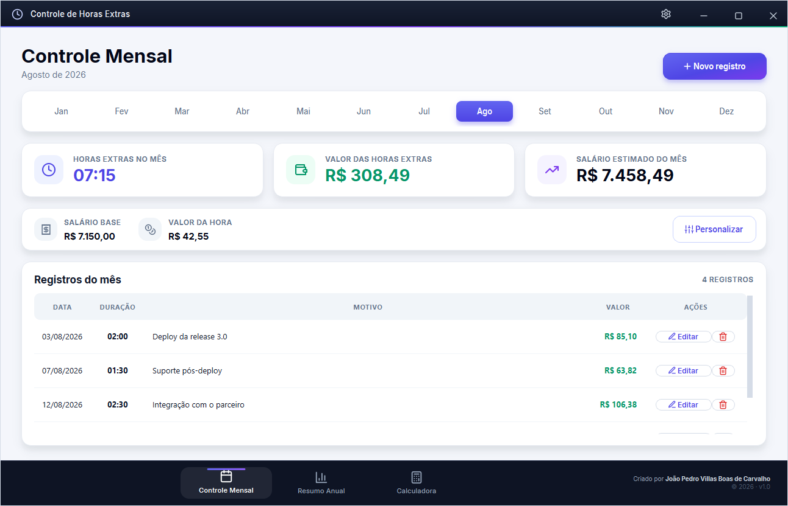
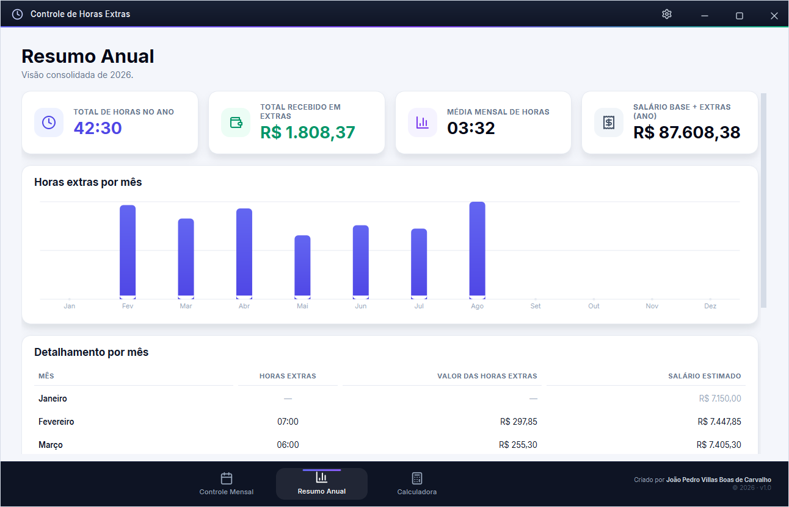
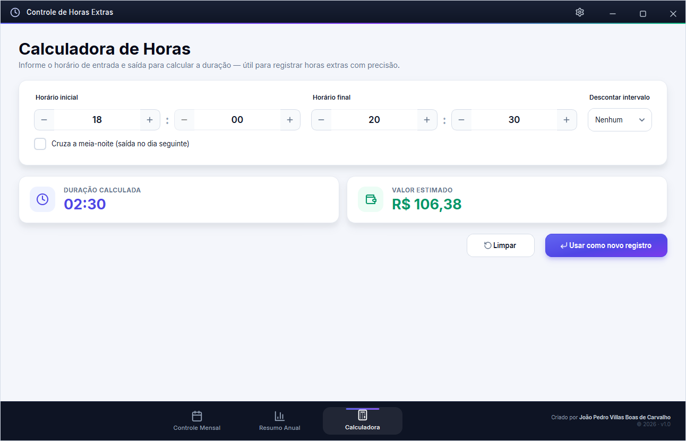
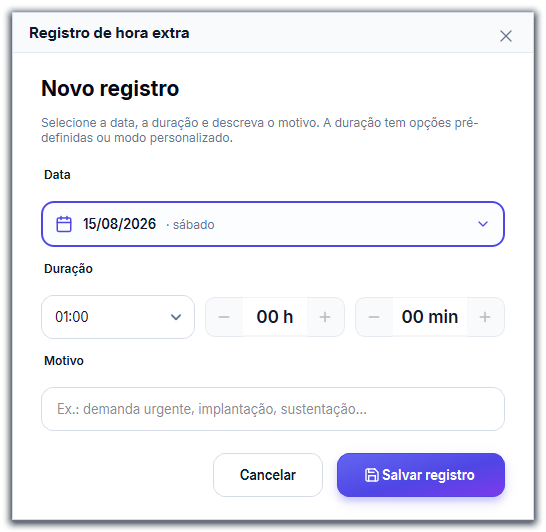
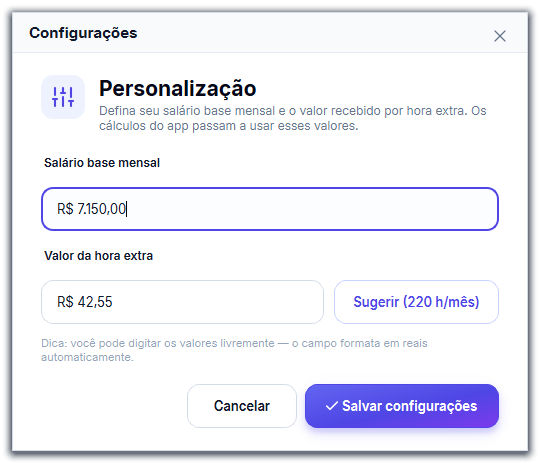

# Controle de Horas Extras

Aplicativo desktop para Windows que registra horas extras, calcula o valor a
receber e consolida os totais do mês e do ano. Feito em Python com PySide6
(Qt 6) e banco de dados local em SQLite.

Os dados ficam somente na máquina do usuário, em
`%APPDATA%\ControleHoras\horas.db`. Não há servidor, conta ou sincronização.

## Telas

### Controle mensal

Registros do mês selecionado, com o total de horas, o valor das extras e o
salário estimado.



### Resumo anual

Totais consolidados do ano, gráfico de horas por mês e detalhamento mês a mês.



### Calculadora de horas

Calcula a duração entre dois horários, com desconto de intervalo e suporte a
turnos que cruzam a meia-noite. O resultado pode virar um registro direto.



### Registro e configurações

| Novo registro | Configurações |
| --- | --- |
|  |  |

## Funcionalidades

- Cadastro, edição e exclusão de horas extras, com data, duração e motivo.
- Navegação entre os meses do ano.
- Cálculo automático do total de horas, do valor das extras e do salário
  estimado do mês.
- Resumo anual com total de horas, valor recebido, média mensal e gráfico de
  horas por mês.
- Calculadora de horas com desconto de intervalo e virada de dia.
- Salário base e valor da hora extra configuráveis, salvos no banco.

## Como o cálculo funciona

```
valor_extra            = total_de_horas_decimais * valor_da_hora
salario_total_estimado = salario_base + valor_extra
```

O total de minutos do mês é convertido em horas decimais e multiplicado pelo
valor da hora extra. O resultado é somado ao salário base para chegar ao
salário estimado do mês.

| Parâmetro | Valor inicial | Onde fica depois |
| --- | --- | --- |
| Salário base | R$ 7.150,00 | Tabela `settings` do SQLite |
| Valor da hora extra | R$ 42,55 | Tabela `settings` do SQLite |

Os valores iniciais estão em [`app/config.py`](app/config.py) e são usados
apenas na primeira execução. Depois disso valem os valores salvos no banco,
alteráveis a qualquer momento pelo botão de configurações.

## Requisitos

- Windows
- Python 3.10 ou superior

## Como executar

```powershell
python -m venv .venv
.venv\Scripts\activate
pip install -r requirements.txt
python main.py
```

## Como gerar o executável

O `build.bat` cria o ambiente virtual (se ainda não existir), instala as
dependências junto com o PyInstaller e empacota o aplicativo em um único
arquivo, sem console e com os assets embutidos:

```powershell
.\build.bat
```

O executável final fica em `dist\Controle de Horas.exe`.

Para empacotar manualmente:

```powershell
pyinstaller --noconfirm --clean --windowed --onefile `
    --name "Controle de Horas" `
    --add-data "app\assets;app\assets" `
    --hidden-import PySide6.QtSvg `
    --collect-submodules PySide6.QtSvg `
    main.py
```

## Estrutura do projeto

```
Controle de Horas/
├── main.py                      # ponto de entrada: HiDPI, fonte, paleta e QSS
├── requirements.txt
├── build.bat
└── app/
    ├── config.py                # valores iniciais, meses e caminho do banco
    ├── database.py              # SQLite: CRUD e agregações
    ├── utils.py                 # formatação de moeda, data e horas
    ├── theme.py                 # constantes de cor, raio e tempo
    ├── icons.py                 # ícones SVG renderizados via QtSvg
    ├── anim.py                  # animações reutilizáveis
    ├── styles.py                # folha de estilo global (QSS)
    ├── assets/                  # ícones SVG e fontes
    └── views/
        ├── main_window.py       # janela principal e navegação
        ├── title_bar.py         # barra de título
        ├── window_controls.py   # botões de minimizar, maximizar e fechar
        ├── monthly_view.py      # tela de controle mensal
        ├── annual_view.py       # tela de resumo anual
        ├── calculator_view.py   # tela da calculadora
        ├── record_dialog.py     # diálogo de novo registro e edição
        ├── settings_dialog.py   # diálogo de configurações
        ├── date_picker.py       # campo de data com calendário
        ├── custom_widgets.py    # botões, seletores e navegação
        ├── widgets.py           # cards e seletor de mês
        ├── chart.py             # gráfico de barras
        └── toast.py             # notificações
```

## Tecnologias

- Python 3.10 ou superior
- PySide6 (Qt 6) para a interface, animações e gráficos
- SQLite para o armazenamento local
- PyInstaller para a geração do executável

## Licença

Distribuído sob a Licença MIT. Veja o arquivo [`LICENSE`](LICENSE).

## Autor

João Pedro Villas Boas de Carvalho
